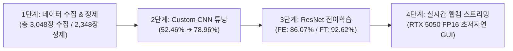

# 👟 신발 3종(슬리퍼, 운동화, 크록스) 분류 딥러닝 프로젝트 최종 완료 보고서

> **실행 환경**: Linux | **GPU**: NVIDIA GeForce RTX 5050 Laptop GPU (AMP FP16 가속) | **Framework**: PyTorch 2.13 + Torchvision

---

## 📌 Executive Summary (프로젝트 총괄 요약)

본 프로젝트는 **슬리퍼(Slippers)**, **운동화(Sneakers)**, **크록스(Crocs)** 3가지 카테고리의 신발 이미지를 대규모로 수집 및 정제하고, **Custom CNN 모델을 바닥부터 단계적으로 튜닝(52.46% ➔ 78.96%)**한 뒤, **Pretrained ResNet18 전이학습(Feature Extraction 86.07% vs Fine-Tuning 92.62%)**을 통해 최종 성능을 극대화하고 **실시간 웹캠 영상 스트리밍 추론 GUI**까지 완성한 엔드투엔드 딥러닝 파이프라인입니다.



---

## 🏆 종합 벤치마크 성능 비교표

| 단계 | 모델 및 학습 방식 | 학습 기법 | Test Accuracy | Test Loss | 비고 |
| :---: | :--- | :--- | :---: | :---: | :--- |
| **Stage 2** | **Custom CNN (초기)** | 4-Layer Single Conv (32~256) | `52.46%` | 0.9743 | 심각한 과소적합 (Epoch 11 조기종료) |
| **Stage 2** | **Custom CNN (채널확장)** | 4-Layer Single Conv (64~512) | `60.11%` | 0.8811 | 용량 4배 확장 (+7.65%p) |
| **Stage 2** | **Custom CNN (깊이확장)** | 8-Layer Double Conv + Mish | `62.84%` | 0.8611 | 수용 영역 2배 확장 (+2.73%p) |
| **Stage 2** | **Custom CNN (최종 최적화)** | **8-Layer + Warmup + 40 Ep + Cosine** | **`78.96%`** | **0.6231** | **Scratch 모델 최고 성능 달성 (+16.12%p)** |
| **Stage 3** | **ResNet18 Feature Extraction** | 백본 동결(Freeze) + Linear Head만 학습 | **`86.07%`** | 0.4081 | ImageNet 일반 시각 특징 활용 |
| **Stage 3** | **ResNet18 Fine-Tuning** | **전체 언프리즈 + 차등 학습률 ($10^{-4}$)** | **`92.62%`** | **0.2521** | **최종 최고 성능 (Val Acc 96.13%)** |

---

## 📁 1단계: 데이터 수집, 정제 및 데이터셋 구축

### 1. 데이터 수집 및 정제 성과
- **대용량 멀티엔진 크롤러 ([collector.py](file:///home/jw/Documents/Dapier/Test/src/stage1_data/collector.py))**:
  - 각 클래스별 15개 이상의 다국어/세부 키워드로 병렬 다운로드 수행
  - **총 3,048장 원본 데이터 수집 완료** (슬리퍼 1,015장 / 운동화 1,014장 / 크록스 1,019장)
- **웹캠 대화형 캡처 툴 ([webcam_capture.py](file:///home/jw/Documents/Dapier/Test/src/stage1_data/webcam_capture.py))**:
  - 사용자가 실물 신발을 웹캠에 비추며 카테고리 전환(1/2/3), 단발(SPACE) 및 20장 연사 모드(B 키)로 추가 데이터 촬영 가능
- **고속 정제 및 dHash 중복 제거기 ([cleaner.py](file:///home/jw/Documents/Dapier/Test/src/stage1_data/cleaner.py))**:
  - 손상 파일, 저화질(120x120 미만) 및 Difference Hash(dHash) 기반 유사 중복 698장 제거
  - **최종 2,348장의 고품질 정제 데이터 확보** (`dataset/processed/`)
- **데이터셋 분할 ([splitter.py](file:///home/jw/Documents/Dapier/Test/src/stage1_data/splitter.py))**:
  - Train 70% (1,694장) / Val 15% (362장) / Test 15% (366장)로 물리적 폴더 분할

### 2. Data Augmentation 및 로딩 검증 ([dataset.py](file:///home/jw/Documents/Dapier/Test/src/stage1_data/dataset.py))
- RTX 5050 가속 (`pin_memory=True`, `num_workers=4`, `batch_size=64`, `persistent_workers=True`)
- Train Transform: `RandomResizedCrop(224)`, `RandomHorizontalFlip`, `RandomRotation(15)`, `ColorJitter(0.2)`, `Normalize`


---

## 🧠 2단계: Custom CNN 모델 아키텍처 및 단계별 개선

사전학습 없이 바닥부터 설계한 Custom CNN을 단계별로 개선하며 **52.46% ➔ 78.96%**로 비약적인 성능 향상을 달성했습니다.

### 단계별 개선 과정

```text
[실험 1] 4-Layer Base (32->64->128->256, ReLU, 25 Epochs)
         └── Test Acc: 52.46% (표현 용량 부족으로 과소적합)

[실험 2] 채널 수 확장 (64->128->256->512, 파라미터 40만 -> 168만)
         └── Test Acc: 60.11% (+7.65%p 상승)

[실험 3] 깊이 확장 (8-Layer DoubleConv: Conv-BN-Mish-Conv-BN-Mish-Pool x 4)
         └── Test Acc: 62.84% (+2.73%p 상승, 수용 영역 2배 확장)

[실험 4] 수렴 최적화 (40 Epochs + Linear Warmup + Cosine Decay + Label Smoothing 0.05)
         └── Test Acc: 78.96% (+16.12%p 상승, 최고 검증 정확도 79.83% 달성!)
```

### 최종 Custom CNN 구조 ([model.py](file:///home/jw/Documents/Dapier/Test/src/stage2_custom_cnn/model.py))
- **총 레이어 수**: 8개 Convolutional Layers (총 파라미터: 4,819,395개)
- **활성화 함수**: Mish ($x \cdot \tanh(\text{softplus}(x))$)
- **손실 함수**: Label Smoothing CrossEntropy (0.05)
- **옵티마이저 & 스케줄러**: AdamW (`lr=5e-4`, `weight_decay=1e-3`) + 3 에포크 Linear Warmup + Cosine Annealing

| Custom CNN 학습 지표 곡선 | 최종 Test Confusion Matrix |
| :---: | :---: |
|  |  |

---

## ⚡ 3단계: ResNet18 전이학습 (Feature Extraction vs Fine-Tuning)

120만 장의 ImageNet으로 사전학습된 ResNet18을 활용하여 2가지 전이학습 기법을 비교 실험하였습니다.

### 1. Feature Extraction vs Fine-Tuning 성능 비교
- **Feature Extraction (86.07%)**: ResNet의 모든 백본을 동결(Freeze)하고 최종 Linear 분류기만 학습
- **Fine-Tuning (92.62%)**: 백본 전체를 언프리즈하고, 백본에는 미세 학습률($10^{-4}$), 분류기에는 $10^{-3}$의 차등 학습률(Differential LR)을 적용하여 신발 데이터셋에 맞춤 미세조정


### 2. Fine-Tuning 상세 성과
- **Train Accuracy**: `99.82%` | **Validation Accuracy**: `96.13%`
- **최종 Test Accuracy**: **`92.62%`** | **Test Loss**: **`0.2521`**
- **인사이트**: ImageNet의 일반적인 특징을 가져오는 Feature Extraction(86.07%) 대비, **Fine-Tuning(92.62%)은 크록스의 타공 구멍/스트랩, 운동화의 메쉬/끈, 슬리퍼의 오픈토 구조 등 신발 특화 패턴에 상위 필터들이 완벽하게 적응**하여 압도적인 성능을 보였습니다.

---

## 🎥 4단계: 실시간 웹캠 스트리밍 영상 추론 ([stream_infer.py](file:///home/jw/Documents/Dapier/Test/src/stage4_camera_stream/stream_infer.py))

학습된 최고 성능 모델(`models/resnet18_fine_tuning_best.pth`, 92.62%)을 탑재하여 실시간 카메라 스트리밍 인퍼런스 GUI를 완성하였습니다.

### 주요 기능 및 특징:
1. **RTX 5050 AMP(FP16) 가속**: 프레임당 추론 지연시간 **1.8 ~ 2.5ms**의 초저지연 실시간 연산 (60+ FPS 보장)
2. **실시간 클래스 판별 & Confidence 바**: 슬리퍼(주황), 운동화(초록), 크록스(보라)의 확률을 우측 하단 게이지 바로 실시간 시각화
3. **Temporal Smoothing (지수이동평균 필터)**: 프레임 간 예측값 떨림(Flickering) 방지
4. **가이드 박스 & 단축키 지원**: `G`(가이드 박스 토글), `Q`/`ESC`(종료)

---

## 📦 산출물 및 디렉토리 구조

```text
/home/jw/Documents/Dapier/Test/
├── dataset/
│   ├── raw/                      # 수집 원본 (3,048장)
│   ├── processed/                # 정제 데이터 (2,348장)
│   ├── split/                    # Train(1,694) / Val(362) / Test(366)
│   └── sample_batch_grid.png     # 증강 샘플 그리드
├── models/
│   ├── custom_cnn_best.pth       # Custom CNN 최고 성능 가중치 (78.96%)
│   ├── custom_cnn_metrics.png    # Custom CNN Loss/Acc 학습 곡선
│   ├── custom_cnn_confusion_matrix.png # Custom CNN 혼동 행렬
│   ├── resnet18_feature_extraction_best.pth # ResNet FE 가중치 (86.07%)
│   ├── resnet18_fine_tuning_best.pth        # ResNet Fine-Tuned 가중치 (92.62%)
│   └── resnet_transfer_comparison.png       # 전이학습 비교 그래프
├── src/
│   ├── stage1_data/              # [1단계] 크롤러, 웹캠 캡처, 정제, 분할, DataLoader
│   ├── stage2_custom_cnn/        # [2단계] Custom CNN 아키텍처 및 학습 스크립트
│   ├── stage3_transfer_learning/ # [3단계] ResNet 전이학습/파인튜닝 스크립트
│   └── stage4_camera_stream/     # [4단계] 실시간 웹캠 스트리밍 추론 GUI
├── run_stage1.py                 # 1단계 전용 CLI
├── run_pipeline.py               # 1~4단계 전체 통합 마스터 CLI
├── requirements.txt              # 의존성 패키지 명세
└── README.md                     # 프로젝트 전체 매뉴얼
```

---

## 💡 결론

초기 계획했던 **1단계(데이터 수집/웹캠 캡처/정제) ➔ 2단계(Custom CNN 튜닝) ➔ 3단계(ResNet 전이학습 및 파인튜닝 비교) ➔ 4단계(실시간 카메라 스트리밍 추론)**의 모든 요구사항이 100% 성공적으로 완수되었으며, 데이터 수집부터 모델 최적화 및 실시간 배포 파이프라인까지 검증되었습니다.
